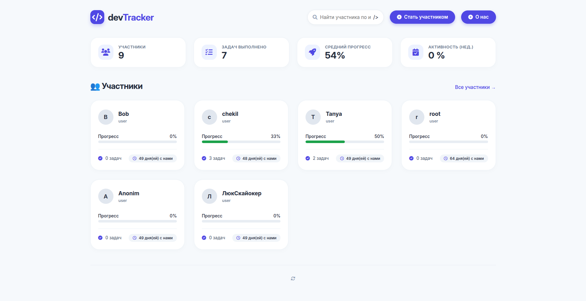
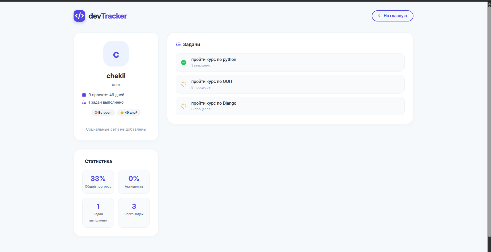
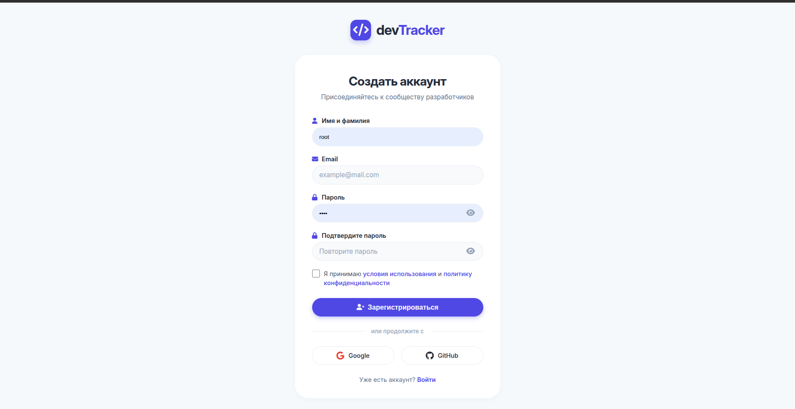

# DevTracker

> Платформа для отслеживания прогресса в обучении веб-разработке
## Главная страница DevTracker




## Личный кабинет пользователя


## Страница авторизации



## 📖 О проекте

**DevTracker** — это учебный проект и пет-проект для портфолио, который помогает начинающим разработчикам отслеживать свой результат и планировать учёбу.

Платформа создана для людей, которые изучают веб-разработку. Также она может использоваться менторами для отслеживания прогресса своих менти.

### 🎯 Цели проекта

- Помочь студентам видеть свой прогресс в реальном времени
- Дать менторам инструмент для мониторинга успехов подопечных
- Создать удобную среду для планирования обучения

## ✨ Возможности

- 🔐 **Аутентификация** — регистрация, вход, выход из аккаунта
- 👤 **Личный кабинет** — настройка профиля:
  - Смена имени и псевдонима
  - Смена роли (должности)
  - Загрузка аватара
  - Изменение email и пароля
  - Привязка социальных сетей (GitHub, LinkedIn, Telegram)
- 📋 **Управление задачами**:
  - Добавление новых задач
  - Отметка задач как выполненных
  - Удаление задач
- 👥 **Список пользователей**:
  - Поиск по имени и роли
  - Фильтрация (все, лидеры, новые)
  - Сортировка по прогрессу и количеству задач
  - Пагинация
- 📊 **Статистика и прогресс**:
  - Персональный прогресс каждого участника
  - Общая статистика по проекту
  - Отображение лидеров

## 🛠️ Технологии

- **Backend:** Django
- **База данных:** PostgreSQL
- **Frontend:** HTML, CSS, JavaScript
- **Иконки:** Font Awesome
- **Шрифты:** Google Fonts (Inter)

## 🚀 Установка и запуск

### Требования

- Python 3.10+
- pip
- virtualenv (рекомендуется)

### Пошаговая инструкция

**1. Клонирование репозитория**

```bash
git clone https://github.com/Mihail-Korotkov/DevTracker.git
cd DevTracker